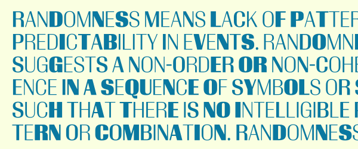

Title: Common Techniques
Summary: Short version for index and feeds
Sortorder: 6

Up until now, almost everything that has been discussed has been the official way to do things or established common practice. The next section is far more subjective as there are numerous ways to write the code to create certain behaviors. What follows includes my own personal opinion.

I have prepared a [demo font](downloads/otcb-demo.zip) that includes all of the features and techniques defined below. You can open it up in your favorite font editor and play around with the features if you want to see how they work. The feature tags in the code below don't always match the tags in the font. I had to do it this way since there can't be more than one version of each feature.

The features in the demo font are by no means to complete or an indication of what is necessary to include in a particular feature. You should develop your own interpretation of what should be included in each feature based on the design of your font.

## Glyph Run and Word Boundary Detection

Often we want to make substitutions based on the bounds of words and glyph runs. For example, to insert a swash only at the beginning or at the end of a word. There are three features in the specification for dealing with these situations:

- `init` — Performs substitutions only at the beginning of a word.
- `fina` — Performs substitutions only at the end of a word.
- `medi` — Performs substitutions only on the glyphs between the first and last in a word.

Unfortunately the specification is a bit vague about how these are supposed to be implemented. The Unicode specification details a word boundary detection algorithm and conceivably that's what would be used by the layout engines that are processing your font. That specification is quite thorough, but it thinks about word boundaries in a different way than type designers do (or at least the type designer writing this does). For example, where are the word boundaries in this text?

- Hello “World!”

They are at the `o`, the `W` and the `d`. *(I'm 99.999999% sure about this, but I should test it again.)* If we use this for swashes our `W` and `d` are likely to clash with the marks `“` and `!` around them. We often think of word boundaries as an empty space around words. If we want to use `init` and `fina`, we'll need to build in exceptions. You can certainly do that, but I generally do it all myself with some special classes:

- `@all` -- This class contains all glyphs.
- `@filled` -- This class contains all glyphs that contain positive space.
- `@empty` -- This glyph contains all glyphs that contain only negative space.

With these, we can build lookups that handle boundary detection reasonable well enough for things like swashes.

    :::fea
    lookup GlyphRunInitial {
        ignore sub @all @initialsOff';
        sub @initialsOff' by @initialsOn;
    } GlyphRunInitial;

    lookup GlyphRunFinal {
        ignore sub @finalsOff' @all;
        sub @finalsOff' by @finalsOn;
    } GlyphRunFinal;

    lookup WordInitial {
        ignore sub @filled @initialsOff';
        sub @initialsOff' by @initialsOn;
    } WordInitial;

    lookup WordMedial {
        sub @filled @medialOff' @filled by @medialOn;
    } WordMedial;

    lookup WordFinal {
        ignore sub @finalsOff' @filled;
        sub @finalsOff' by @finalsOn;
    } WordFinal;

To be clear, you should not use this for shaping Arabic or anything like that. This is strictly for aesthetic substitutions like swashes.

## Script And Language Specific Forms

The `locl` feature is specifically designed to implement global script and language specific changes that need to happen before any other features are processed. You can certainly put stylistic specific changes in other features, but the big important ones should be in `locl`.

    :::fea
    feature locl {

        script latn;

            language NLD exclude_dflt;
                lookup DutchIJ {
                    sub IJ by IJ.dutch;
                } DutchIJ;

    } locl;

## Fractions

I have used two different algorithms for implementing on-the-fly fractions. The first is fairly straightforward. The second is more complex but I think it is easier for users.

### Method 1: Individual

This method has been around for as long as I have been working on OpenType features. Adobe probably developed it in the very early days of the .fea language. It is probably still the most common implementation.

    :::fea
    feature frac {
        @slash = [slash fraction];

        lookup FractionNumerators {
            sub @figures by @figuresNumerator;
        } FractionNumerators;

        sub [@slash @figuresDenominator] @figuresNumerator' by @figuresDenominator;
        sub slash by fraction;
    } frac;

### Method 2: Contextual

Around 2006 [Kent Lew](http://www.fontbureau.com/people/KentLew/) asked me if I had any ideas for a better fraction implementation. Specifically, he was referring to the fact that with the existing implementation users had to manually select *only* the text that should be converted to fractions and apply the feature. If the feature was applied to more than just that text all numbers not in a fraction would be converted to numerators. This was a big problem in things like cookbooks where there could be *thousands* of little bits of text that had to be converted to fractions.

I developed a new method that is built on the common form of writing fractions as an integer, a space, a numerator, a slash and a denominator. For example: `2 1/2`. The code considers 1-10 numbers followed by a slash followed by 1 or more numbers to be a fraction. The slash is converted to a fraction bar, the numbers before the slash are converted to numerators and the numbers after the slash are converted to denominators. If the new fraction is preceded by a number followed by a space, the space is converted to a thin space to pull the fraction closer to the integer. After I published the first version of this code, [Karsten Luecke](http://kltf.de) pointed out some some problems with dates, German tax numbers and things like that. I published a new version that handles these properly and this version is below.

With this users can *globally* activate fractions. The only drawback that I have found with this is that it doesn't allow numerators to be longer than 10 numbers long. In the unlikely event that a user runs into this problem, they can select the unconverted numerators and activate the numerator feature.

    :::fea
    feature frac {

        lookup FractionBar {
            ignore sub slash @figures @figures @figures @figures @figures @figures @figures @figures @figures @figures slash';
            ignore sub slash' @figures @figures @figures @figures @figures @figures @figures @figures @figures @figures slash;
            ignore sub slash @figures @figures @figures @figures @figures @figures @figures @figures @figures slash';
            ignore sub slash' @figures @figures @figures @figures @figures @figures @figures @figures @figures slash;
            ignore sub slash @figures @figures @figures @figures @figures @figures @figures @figures slash';
            ignore sub slash' @figures @figures @figures @figures @figures @figures @figures @figures slash;
            ignore sub slash @figures @figures @figures @figures @figures @figures @figures slash';
            ignore sub slash' @figures @figures @figures @figures @figures @figures @figures slash;
            ignore sub slash @figures @figures @figures @figures @figures @figures slash';
            ignore sub slash' @figures @figures @figures @figures @figures @figures slash;
            ignore sub slash @figures @figures @figures @figures @figures slash';
            ignore sub slash' @figures @figures @figures @figures @figures slash;
            ignore sub slash @figures @figures @figures @figures slash';
            ignore sub slash' @figures @figures @figures @figures slash;
            ignore sub slash @figures @figures @figures slash';
            ignore sub slash' @figures @figures @figures slash;
            ignore sub slash @figures @figures slash';
            ignore sub slash' @figures @figures slash;
            ignore sub slash @figures slash';
            ignore sub slash' @figures slash;
            ignore sub slash slash';
            ignore sub slash' slash;
            sub @figures slash' @figures by fraction;
        } FractionBar;

        lookup Numerator1 {
            sub @figures' fraction by @figuresNumerator;
        } Numerator1;

        lookup Numerator2 {
            sub @figures' @figuresNumerator fraction by @figuresNumerator;
        } Numerator2;

        lookup Numerator3 {
            sub @figures' @figuresNumerator @figuresNumerator fraction by @figuresNumerator;
        } Numerator3;

        lookup Numerator4 {
            sub @figures' @figuresNumerator @figuresNumerator @figuresNumerator fraction by @figuresNumerator;
        } Numerator4;

        lookup Numerator5 {
            sub @figures' @figuresNumerator @figuresNumerator @figuresNumerator @figuresNumerator fraction by @figuresNumerator;
        } Numerator5;

        lookup Numerator6 {
            sub @figures' @figuresNumerator @figuresNumerator @figuresNumerator @figuresNumerator @figuresNumerator fraction by @figuresNumerator;
        } Numerator6;

        lookup Numerator7 {
            sub @figures' @figuresNumerator @figuresNumerator @figuresNumerator @figuresNumerator @figuresNumerator @figuresNumerator fraction by @figuresNumerator;
        } Numerator7;

        lookup Numerator8 {
            sub @figures' @figuresNumerator @figuresNumerator @figuresNumerator @figuresNumerator @figuresNumerator @figuresNumerator @figuresNumerator fraction by @figuresNumerator;
        } Numerator8;

        lookup Numerator9 {
            sub @figures' @figuresNumerator @figuresNumerator @figuresNumerator @figuresNumerator @figuresNumerator @figuresNumerator @figuresNumerator @figuresNumerator fraction by @figuresNumerator;
        } Numerator9;

        lookup Numerator10 {
            sub @figures' @figuresNumerator @figuresNumerator @figuresNumerator @figuresNumerator @figuresNumerator @figuresNumerator @figuresNumerator @figuresNumerator @figuresNumerator fraction by @figuresNumerator;
        } Numerator10;

        lookup Denominator {
            sub [fraction @figuresDenominator] @figures' by @figuresDenominator;
        } Denominator;

        sub @figures space' @figuresNumerator by uni2009;
    } frac;

### Numerators

The `numr` feature is designed to convert all numbers to numerators.

    :::fea
    feature numr {
        sub @figures by @figuresNumerator;
    } numr;

### Denominators

The `dnom` feature is designed to convert all numbers to denominators.

    :::fea
    feature dnom {
        sub @figures by @figuresDenominator;
    } dnom;

## Superscript

The `sups` feature is for superscript forms.

    :::fea
    feature sups {
        sub @figures by @figuresSuperscript;
        sub @letters by @lettersSuperscript;
    } sups;

## Subscript

The `subs` feature is for subscript forms.

    :::fea
    feature subs {
        sub @figures by @figuresSubscript;
        sub @letters by @lettersSubscript;
    } subs;

## Figures

If your font only includes one figure style, you don't need to do anything. If you do have more than one, you have to do some awkward things due to some odd behaviors in various applications. First off, it's best to define a feature for your default figures even though it will never be used. For example, in the demo font the default figures are lining and there are old style figures as alternates. First up we need to define the lining figures feature (`lnum`) even though it will never actually be used. Then we define the old style feature (`onum`).

    :::fea
    feature lnum {
        sub @figuresOldStyle by @figures;
    } lnum;

    feature onum {
        sub @figures by @figuresOldStyle;
    } onum;

Likewise, if your default figures are proportional and you have tabular alternates, you need to define the proportional figures feature (`pnum`) and then define the tabular figures feature (`tnum`).

    :::fea
    feature pnum {
        sub @figuresTabular by @figures;
        sub @figuresOldStyleTabular by @figuresOldStyle;
    } pnum;

    feature tnum {
        sub @figures by @figuresTabular;
        sub @figuresOldStyle by @figuresOldStyleTabular;
    } tnum;

## Small Caps

There are two features that invoke small caps: small caps `smcp` and “caps to small caps” or “all small caps” `c2sc`. The latter version is for situations in which the user wants everything possible, not just letters, to be converted to small cap forms.

**(something about not doing case conversion, but being aware of things like the germanbls, dotlessi?)**

    :::fea
    feature smcp {
        sub @lowercase by @smallCaps;
    } smcp;

    feature c2sc {
        sub @uppercase by @smallCaps;
        sub @lowercase by @smallCaps;
        sub @figures by @figuresSmallCap;
    } c2sc;

## All Caps

There are two features that should be activated when the user indicates that they want all text converted to uppercase. The `case` feature transforms any glyphs that should be changed to an uppercase alternate. You should not define the transformation from lowercase to uppercase for alphabetic forms. The layout engine will do that for you.

    :::fea
    feature case {
        sub @punctuationUppercaseOff by @punctuationUppercaseOn;
    } case;

The `cpsp` feature allows you to define specific spacing for all caps settings:

    :::fea
    feature cpsp {
        pos @uppercase <100 0 200 0>;
        pos @punctuationUppercaseOn <100 0 200 0>;
    } cpsp;

Note that these features will not be activated whenever the user types in all capitals. The features must be activated manually.

## Swashes

There are two swash features `swsh` and `cswh`. I prefer to use the contextual version `cswh`. What this feature does will depend on the swash glyphs in your font.

    :::fea
    feature cswh {
        ignore sub @filled @swashInitialsOff';
        sub @swashInitialsOff' by @swashInitialsOn;
    } cswh;

## Titling Alternates

The titling alternates feature `titl` is, as its name suggests, for titling specific alternates.

    :::fea
    feature titl {
        sub @uppercase by @titlingCaps;
    } titl;

## Stylistic Sets

There are 20 special feature tags that allow you to develop your own behavior that doesn't neatly fit into any of the registered layout tags. These are known as stylistic sets and have tags `ss01`, `ss02`, `ss03` and so on. The implementation of the rules in these is completely arbitrary.

## Ligatures

There are several features that are designed to work with ligatures. The two most prominent are Common Ligatures `liga` and Discretionary Ligatures `dlig`.

The Common Ligatures feature is for ligatures that you think should be used almost all of the time.

    :::fea
    feature liga {
        sub f i by f_i;
        sub f l by f_l;
    } liga;

The Discretionary Ligatures feature is for ligatures that you think should be used sparingly.

    :::fea
    feature dlig {
        sub O O by O_O;
    } dlig;

As everywhere else, the ordering of the rules is very important within these features. You should always order them from longest target sequence to shortest. For example:

    :::fea
    sub o f f i by o_f_f_i; 
    sub f f i by f_f_i;
    sub f f by f_f;
    sub f i by f_i;

Would this sequence be ordered from bottom to top, the `f_f_i` and `o_f_f_i` would have no chance of ever occurring, since their source glyphs already would have been converted beforehand.

## Manual Alternate Access

There is one special feature that is used to determine the alternates displayed in the glyph access palette in popular design software. This feature `aalt` is processed after all other substitution features regardless of where you have it ordered in your feature definitions.

There are a couple of different ways to define the rules in this feature, but I prefer to do it manually with individual one from many rules.

    :::fea
    feature aalt {
        sub A from [A.swash A.title A.random1 A.random2 A.sc];
        sub B from [B.swash B.title B.random1 B.random2 B.sc];
        sub C from [C.swash C.title C.random1 C.random2 C.sc];
        sub D from [D.swash D.title D.random1 D.random2 D.sc];
        sub E from [E.swash E.title E.random1 E.random2 E.sc];
        sub F from [F.swash F.title F.random1 F.random2 F.sc];
        sub G from [G.swash G.title G.random1 G.random2 G.sc];
        sub H from [H.swash H.title H.random1 H.random2 H.sc];
        sub I from [I.swash I.title I.random1 I.random2 I.sc];
        sub J from [J.swash J.title J.random1 J.random2 J.alt J.scalt J.sc];
        sub K from [K.swash K.title K.random1 K.random2 K.sc];
        sub L from [L.swash L.title L.random1 L.random2 L.sc];
        sub M from [M.swash M.title M.random1 M.random2 M.sc];
        sub N from [N.swash N.title N.random1 N.random2 N.sc];
        sub O from [O.swash O.title O.random1 O.random2 O.sc];
        sub P from [P.swash P.title P.random1 P.random2 P.sc];
        sub Q from [Q.swash Q.title Q.random1 Q.random2 Q.sc];
        sub R from [R.swash R.title R.random1 R.random2 R.sc];
        sub S from [S.swash S.title S.random1 S.random2 S.sc];
        sub T from [T.swash T.title T.random1 T.random2 T.sc];
        sub U from [U.swash U.title U.random1 U.random2 U.sc];
        sub V from [V.swash V.title V.random1 V.random2 V.sc];
        sub W from [W.swash W.title W.random1 W.random2 W.sc];
        sub X from [X.swash X.title X.random1 X.random2 X.sc];
        sub Y from [Y.swash Y.title Y.random1 Y.random2 Y.sc];
        sub Z from [Z.swash Z.title Z.random1 Z.random2 Z.sc];
        sub IJ from [IJ.dutch];
        sub zero from [zero.den zero.num zero.old zero.sub zero.sup zero.tab zero.oldtab zero.sc];
        sub one from [one.den one.num one.old one.sub one.sup one.tab one.oldtab one.sc];
        sub two from [two.den two.num two.old two.sub two.sup two.tab two.oldtab two.sc];
        sub three from [three.den three.num three.old three.sub three.sup three.tab three.oldtab three.sc];
        sub four from [four.den four.num four.old four.sub four.sup four.tab four.oldtab four.sc];
        sub five from [five.den five.num five.old five.sub five.sup five.tab five.oldtab five.sc];
        sub six from [six.den six.num six.old six.sub six.sup six.tab six.oldtab six.sc];
        sub seven from [seven.den seven.num seven.old seven.sub seven.sup seven.tab seven.oldtab seven.sc];
        sub eight from [eight.den eight.num eight.old eight.sub eight.sup eight.tab eight.oldtab eight.sc];
        sub nine from [nine.den nine.num nine.old nine.sub nine.sup nine.tab nine.oldtab nine.sc];
        sub exclamdown from [exclamdown.uc];
        sub questiondown from [questiondown.uc];
        sub at from [at.uc];
    } aalt;

## Fun Stuff

Small caps and swashes are fun, but for me the real fun is in making fonts do unexpected things. Below are various unusual problems that I've been faced with and how I solved them.

### Randomization

Everyone wants their font to look like the glyphs were randomly drawn. But, let's establish something first: No one will ever do randomization better than [LettError](http://letterror.com) did in their famous [Beowolf](http://letterror.com/beowolf). **No one.** Still want try some randomization? Okay.

Randomization is a bit of a Holy Grail in the OpenType world. The problem is that it's not actually possible for a couple of reasons. For one thing, we can only select from alternates, not actually modify glyph outlines. For another, for true pseudo-randomization there needs to be an external source that influences the random selection process and we can't build a [random seed](http://en.wikipedia.org/wiki/Random_seed) generator with the OpenType tables. So, we have to fake it. There are a number of methods that can be used to do this. I have three that I like.

*(PS: That `rand` "random alternates" feature in the OpenType Layout Tag Registry? It's not supported widely, if at all. Sorry.)*

#### Method 1: Endless Cycle

This method is useful when you don't have a preferred version of a glyph. For example, say you draw three glyphs for every character and you want those spread out across the text. This method will cycle between the glyphs.

For example:

Given enough alternates, this creates an effective illusion in a large block of text.

The code is very simple:

    :::fea
    feature calt {
        @randomCycle1 = [@uppercase];
        @randomCycle2 = [A.random1 B.random1 C.random1 D.random1 E.random1 F.random1 G.random1 H.random1 I.random1 J.random1 K.random1 L.random1 M.random1 N.random1 O.random1 P.random1 Q.random1 R.random1 S.random1 T.random1 U.random1 V.random1 W.random1 X.random1 Y.random1 Z.random1];
        @randomCycle3 = [A.random2 B.random2 C.random2 D.random2 E.random2 F.random2 G.random2 H.random2 I.random2 J.random2 K.random2 L.random2 M.random2 N.random2 O.random2 P.random2 Q.random2 R.random2 S.random2 T.random2 U.random2 V.random2 W.random2 X.random2 Y.random2 Z.random2];

        sub @randomCycle1 @randomCycle1' by @randomCycle2;
        sub @randomCycle2 @randomCycle1' by @randomCycle3;
    } calt;

#### Method 2: Duplicate Eliminator

This method is useful if you want to tightly control the deployment of alternates. Specifically, if you only want an alternate to appear if the glyph that it is an alternate to has appeared recently.

For example:

The code is lengthy, but fairly straightforward:

    :::fea
    feature calt {

        @randomDuplicateSkip = [@uppercase];

        lookup RandomDuplicate1 {
            sub A A' by A.random1;
            sub B B' by B.random1;
            sub C C' by C.random1;
            sub D D' by D.random1;
            sub E E' by E.random1;
            sub F F' by F.random1;
            sub G G' by G.random1;
            sub H H' by H.random1;
            sub I I' by I.random1;
            sub J J' by J.random1;
            sub K K' by K.random1;
            sub L L' by L.random1;
            sub M M' by M.random1;
            sub N N' by N.random1;
            sub O O' by O.random1;
            sub P P' by P.random1;
            sub Q Q' by Q.random1;
            sub R R' by R.random1;
            sub S S' by S.random1;
            sub T T' by T.random1;
            sub U U' by U.random1;
            sub V V' by V.random1;
            sub W W' by W.random1;
            sub X X' by X.random1;
            sub Y Y' by Y.random1;
            sub Z Z' by Z.random1;
        } RandomDuplicate1;

        lookup RandomDuplicate2 {
            sub A @randomDuplicateSkip A' by A.random1;
            sub B @randomDuplicateSkip B' by B.random1;
            sub C @randomDuplicateSkip C' by C.random1;
            sub D @randomDuplicateSkip D' by D.random1;
            sub E @randomDuplicateSkip E' by E.random1;
            sub F @randomDuplicateSkip F' by F.random1;
            sub G @randomDuplicateSkip G' by G.random1;
            sub H @randomDuplicateSkip H' by H.random1;
            sub I @randomDuplicateSkip I' by I.random1;
            sub J @randomDuplicateSkip J' by J.random1;
            sub K @randomDuplicateSkip K' by K.random1;
            sub L @randomDuplicateSkip L' by L.random1;
            sub M @randomDuplicateSkip M' by M.random1;
            sub N @randomDuplicateSkip N' by N.random1;
            sub O @randomDuplicateSkip O' by O.random1;
            sub P @randomDuplicateSkip P' by P.random1;
            sub Q @randomDuplicateSkip Q' by Q.random1;
            sub R @randomDuplicateSkip R' by R.random1;
            sub S @randomDuplicateSkip S' by S.random1;
            sub T @randomDuplicateSkip T' by T.random1;
            sub U @randomDuplicateSkip U' by U.random1;
            sub V @randomDuplicateSkip V' by V.random1;
            sub W @randomDuplicateSkip W' by W.random1;
            sub X @randomDuplicateSkip X' by X.random1;
            sub Y @randomDuplicateSkip Y' by Y.random1;
            sub Z @randomDuplicateSkip Z' by Z.random1;
        } RandomDuplicate2;

        lookup RandomDuplicate3 {
            sub A @randomDuplicateSkip @randomDuplicateSkip A' by A.random1;
            sub B @randomDuplicateSkip @randomDuplicateSkip B' by B.random1;
            sub C @randomDuplicateSkip @randomDuplicateSkip C' by C.random1;
            sub D @randomDuplicateSkip @randomDuplicateSkip D' by D.random1;
            sub E @randomDuplicateSkip @randomDuplicateSkip E' by E.random1;
            sub F @randomDuplicateSkip @randomDuplicateSkip F' by F.random1;
            sub G @randomDuplicateSkip @randomDuplicateSkip G' by G.random1;
            sub H @randomDuplicateSkip @randomDuplicateSkip H' by H.random1;
            sub I @randomDuplicateSkip @randomDuplicateSkip I' by I.random1;
            sub J @randomDuplicateSkip @randomDuplicateSkip J' by J.random1;
            sub K @randomDuplicateSkip @randomDuplicateSkip K' by K.random1;
            sub L @randomDuplicateSkip @randomDuplicateSkip L' by L.random1;
            sub M @randomDuplicateSkip @randomDuplicateSkip M' by M.random1;
            sub N @randomDuplicateSkip @randomDuplicateSkip N' by N.random1;
            sub O @randomDuplicateSkip @randomDuplicateSkip O' by O.random1;
            sub P @randomDuplicateSkip @randomDuplicateSkip P' by P.random1;
            sub Q @randomDuplicateSkip @randomDuplicateSkip Q' by Q.random1;
            sub R @randomDuplicateSkip @randomDuplicateSkip R' by R.random1;
            sub S @randomDuplicateSkip @randomDuplicateSkip S' by S.random1;
            sub T @randomDuplicateSkip @randomDuplicateSkip T' by T.random1;
            sub U @randomDuplicateSkip @randomDuplicateSkip U' by U.random1;
            sub V @randomDuplicateSkip @randomDuplicateSkip V' by V.random1;
            sub W @randomDuplicateSkip @randomDuplicateSkip W' by W.random1;
            sub X @randomDuplicateSkip @randomDuplicateSkip X' by X.random1;
            sub Y @randomDuplicateSkip @randomDuplicateSkip Y' by Y.random1;
            sub Z @randomDuplicateSkip @randomDuplicateSkip Z' by Z.random1;
        } RandomDuplicate3;

    } calt;

#### Method 3: Quantum

This method is for dedicated randomization aficionados. A little history about how this came about: in 2005 I wanted to see if I could come up with a randomization technique that produced less predictable results than the methods above. I realized that I could use the text that the feature is transforming as a pseudo-pseudo-random seed. I was reading a tiny bit about quantum mechanics around the same time and my very limited understanding of some of the experiments in that field gave me an idea. That's a story that I won't get into here. Anyway, the code is long and convoluted, but the idea is pretty simple. I'll give you an overview.

Before we get to rules, we establish several important classes. First we create two *trigger* classes. The first will contain half of the glyphs in the font and the next will contain the other half of the glyphs. These need to be randomly chosen. In other words, don't put A-Z in the same class. That won't produce the desired result. Next, we establish *alternate states* for glyphs. These states are defined in a series of classes. Each of these classes contain a glyph and its alternate. The next class contains the opposite of the previous class. For example:

    :::fea
    @class1 = [A A.alt];
    @class2 = [A.alt A];

Finally, we establish a *skip* class that contains everything in the font.

The glyph processing happens in a series of lookups that each pass over the entire glyph run. As a glyph, let's call it `P`, is being processed the lookup backtracks a specific number of glyphs. The glyph at the beginning of that backtrack, let's call it `B`, is then tested against a class, let's call it `@T`. Importantly, `@T` only contains half of the glyphs in the font. If `B` is in `@T`, `P` is switched to an alternate state. Thus, each glyph state is dependent on the state of all the glyphs that precede it. Given that the text is most likely going to have unpredictable letter combinations, we get a fairly effective randomization. For example:

Is it real randomization? No. Is it perfect? No. Is it incredibly complex and hard to write? Yes. (Unless you use a script to write it.) Can it be slow if a font contains a large number of glyphs and the glyph run being processed is very long? Yes. Is it awesome anyway? I think so.

    :::fea
    feature calt {
        @randomQuantumTrigger1 = [A.random1 A.random2 B B.random2 C C.random1 C.random2 D D.random1 E.random1 G G.random2 H H.random2 I J K.random1 L.random2 N.random1 O O.random1 P.random1 P.random2 Q.random1 S S.random1 S.random2 T T.random1 U.random2 V W.random1 W.random2 X X.random1 Y Y.random1 Y.random2 Z.random2];
        @randomQuantumTrigger2 = [A B.random1 D.random2 E E.random2 F F.random1 F.random2 G.random1 H.random1 I.random1 I.random2 J.random1 J.random2 K K.random2 L L.random1 M M.random1 M.random2 N N.random2 O.random2 P Q Q.random2 R R.random1 R.random2 T.random2 U U.random1 V.random1 V.random2 W X.random2 Z Z.random1 space];

        @randomQuantumGlyphs1 = [A         B         C         D         E         F         G         H         I         J         K         L         M         N         O         P         Q         R         S         T         U         V         W         X         Y         Z];
        @randomQuantumGlyphs2 = [A.random1 B.random1 C.random1 D.random1 E.random1 F.random1 G.random1 H.random1 I.random1 J.random1 K.random1 L.random1 M.random1 N.random1 O.random1 P.random1 Q.random1 R.random1 S.random1 T.random1 U.random1 V.random1 W.random1 X.random1 Y.random1 Z.random1];
        @randomQuantumGlyphs3 = [A.random2 B.random2 C.random2 D.random2 E.random2 F.random2 G.random2 H.random2 I.random2 J.random2 K.random2 L.random2 M.random2 N.random2 O.random2 P.random2 Q.random2 R.random2 S.random2 T.random2 U.random2 V.random2 W.random2 X.random2 Y.random2 Z.random2];

        @randomQuantumState1 = [@randomQuantumGlyphs1 @randomQuantumGlyphs3 @randomQuantumGlyphs2];
        @randomQuantumState2 = [@randomQuantumGlyphs2 @randomQuantumGlyphs1 @randomQuantumGlyphs3];
        @randomQuantumState3 = [@randomQuantumGlyphs3 @randomQuantumGlyphs2 @randomQuantumGlyphs1];

        @randomQuantumSkip = [@uppercase space];

        lookup RandomQuantum10 {
            sub @randomQuantumTrigger1 @randomQuantumSkip @randomQuantumSkip @randomQuantumSkip @randomQuantumSkip @randomQuantumSkip @randomQuantumSkip @randomQuantumSkip @randomQuantumSkip @randomQuantumSkip @randomQuantumSkip @randomQuantumState1' by @randomQuantumState2;
        } RandomQuantum10;

        lookup RandomQuantum9 {
            sub @randomQuantumTrigger2 @randomQuantumSkip @randomQuantumSkip @randomQuantumSkip @randomQuantumSkip @randomQuantumSkip @randomQuantumSkip @randomQuantumSkip @randomQuantumSkip @randomQuantumSkip @randomQuantumState2' by @randomQuantumState3;
        } RandomQuantum9;

        lookup RandomQuantum8 {
            sub @randomQuantumTrigger1 @randomQuantumSkip @randomQuantumSkip @randomQuantumSkip @randomQuantumSkip @randomQuantumSkip @randomQuantumSkip @randomQuantumSkip @randomQuantumSkip @randomQuantumState3' by @randomQuantumState1;
        } RandomQuantum8;

        lookup RandomQuantum7 {
            sub @randomQuantumTrigger2 @randomQuantumSkip @randomQuantumSkip @randomQuantumSkip @randomQuantumSkip @randomQuantumSkip @randomQuantumSkip @randomQuantumSkip @randomQuantumState1' by @randomQuantumState2;
        } RandomQuantum7;

        lookup RandomQuantum6 {
            sub @randomQuantumTrigger1 @randomQuantumSkip @randomQuantumSkip @randomQuantumSkip @randomQuantumSkip @randomQuantumSkip @randomQuantumSkip @randomQuantumState2' by @randomQuantumState3;
        } RandomQuantum6;

        lookup RandomQuantum5 {
            sub @randomQuantumTrigger2 @randomQuantumSkip @randomQuantumSkip @randomQuantumSkip @randomQuantumSkip @randomQuantumSkip @randomQuantumState3' by @randomQuantumState1;
        } RandomQuantum5;

        lookup RandomQuantum4 {
            sub @randomQuantumTrigger1 @randomQuantumSkip @randomQuantumSkip @randomQuantumSkip @randomQuantumSkip @randomQuantumState1' by @randomQuantumState2;
        } RandomQuantum4;

        lookup RandomQuantum3 {
            sub @randomQuantumTrigger2 @randomQuantumSkip @randomQuantumSkip @randomQuantumSkip @randomQuantumState2' by @randomQuantumState3;
        } RandomQuantum3;

        lookup RandomQuantum2 {
            sub @randomQuantumTrigger1 @randomQuantumSkip @randomQuantumSkip @randomQuantumState3' by @randomQuantumState1;
        } RandomQuantum2;

        lookup RandomQuantum1 {
            sub @randomQuantumTrigger2 @randomQuantumState1' by @randomQuantumState2;
        } RandomQuantum1;

        lookup RandomQuantum0 {
            sub @randomQuantumTrigger1 @randomQuantumState2' by @randomQuantumState3;
        } RandomQuantum0;

    } calt;

#### Bonus: Quantum Positioning

It's possible to extend the quantum randomization method above and use it to randomly shift glyphs around.

Possible, but probably not advisable. The support for this is almost certainly going to be uneven.

The code is similar to the substitution method. In this case, instead of states, the cumulative effect that lookups have on glyph records is used.

    :::fea
    feature ss01 {
        @randomPositionQuantumTrigger1 = [A.random2 B B.random1 C.random2 D D.random1 E.random2 F F.random1 F.random2 G G.random2 H H.random2 I.random1 I.random2 J.random1 J.random2 K.random2 L.random1 M.random1 N O Q Q.random1 R S S.random1 T.random1 T.random2 U U.random1 U.random2 W.random1 X.random1 X.random2 Z Z.random2 space];
        @randomPositionQuantumTrigger2 = [A A.random1 B.random2 C C.random1 D.random2 E E.random1 G.random1 H.random1 I J K K.random1 L L.random2 M M.random2 N.random1 N.random2 O.random1 O.random2 P P.random1 P.random2 Q.random2 R.random1 R.random2 S.random2 T V V.random1 V.random2 W W.random2 X Y Y.random1 Y.random2 Z.random1];

        @randomPositionQuantumTarget = [@randomPositionQuantumTrigger1 @randomPositionQuantumTrigger2];

        @randomPositioningQuantumSkip = [@randomPositionQuantumTrigger1 @randomPositionQuantumTrigger2];

        lookup RandomPositioningQuantum9 {
            pos @randomQuantumTrigger2 @randomPositioningQuantumSkip @randomPositioningQuantumSkip @randomPositioningQuantumSkip @randomPositioningQuantumSkip @randomPositioningQuantumSkip @randomPositioningQuantumSkip @randomPositioningQuantumSkip @randomPositioningQuantumSkip @randomPositioningQuantumSkip @randomPositionQuantumTarget' <0 50 0 0>;
        } RandomPositioningQuantum9;

        lookup RandomPositioningQuantum8 {
            pos @randomQuantumTrigger1 @randomPositioningQuantumSkip @randomPositioningQuantumSkip @randomPositioningQuantumSkip @randomPositioningQuantumSkip @randomPositioningQuantumSkip @randomPositioningQuantumSkip @randomPositioningQuantumSkip @randomPositioningQuantumSkip @randomPositionQuantumTarget' <0 40 0 0>;
        } RandomPositioningQuantum8;

        lookup RandomPositioningQuantum7 {
            pos @randomQuantumTrigger2 @randomPositioningQuantumSkip @randomPositioningQuantumSkip @randomPositioningQuantumSkip @randomPositioningQuantumSkip @randomPositioningQuantumSkip @randomPositioningQuantumSkip @randomPositioningQuantumSkip @randomPositionQuantumTarget' <0 30 0 0>;
        } RandomPositioningQuantum7;

        lookup RandomPositioningQuantum6 {
            pos @randomQuantumTrigger1 @randomPositioningQuantumSkip @randomPositioningQuantumSkip @randomPositioningQuantumSkip @randomPositioningQuantumSkip @randomPositioningQuantumSkip @randomPositioningQuantumSkip @randomPositionQuantumTarget' <0 20 0 0>;
        } RandomPositioningQuantum6;

        lookup RandomPositioningQuantum5 {
            pos @randomQuantumTrigger2 @randomPositioningQuantumSkip @randomPositioningQuantumSkip @randomPositioningQuantumSkip @randomPositioningQuantumSkip @randomPositioningQuantumSkip @randomPositionQuantumTarget' <0 10 0 0>;
        } RandomPositioningQuantum5;

        lookup RandomPositioningQuantum4 {
            pos @randomQuantumTrigger1 @randomPositioningQuantumSkip @randomPositioningQuantumSkip @randomPositioningQuantumSkip @randomPositioningQuantumSkip @randomPositionQuantumTarget' <0 -10 0 0>;
        } RandomPositioningQuantum4;

        lookup RandomPositioningQuantum3 {
            pos @randomQuantumTrigger2 @randomPositioningQuantumSkip @randomPositioningQuantumSkip @randomPositioningQuantumSkip @randomPositionQuantumTarget' <0 -20 0 0>;
        } RandomPositioningQuantum3;

        lookup RandomPositioningQuantum2 {
            pos @randomQuantumTrigger1 @randomPositioningQuantumSkip @randomPositioningQuantumSkip @randomPositionQuantumTarget' <0 -30 0 0>;
        } RandomPositioningQuantum2;

        lookup RandomPositioningQuantum1 {
            pos @randomQuantumTrigger2 @randomPositioningQuantumSkip @randomPositionQuantumTarget' <0 -40 0 0>;
        } RandomPositioningQuantum1;

        lookup RandomPositioningQuantum0 {
            pos @randomQuantumTrigger1 @randomPositionQuantumTarget' <0 -50 0 0>;
        } RandomPositioningQuantum0;

    } ss01;
